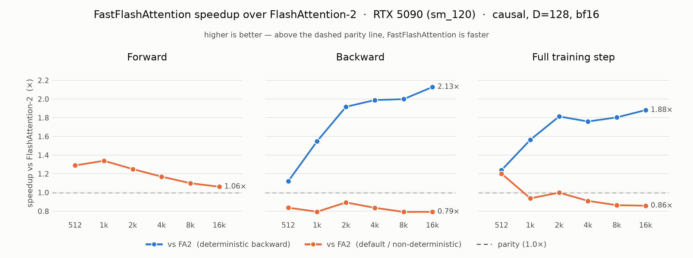
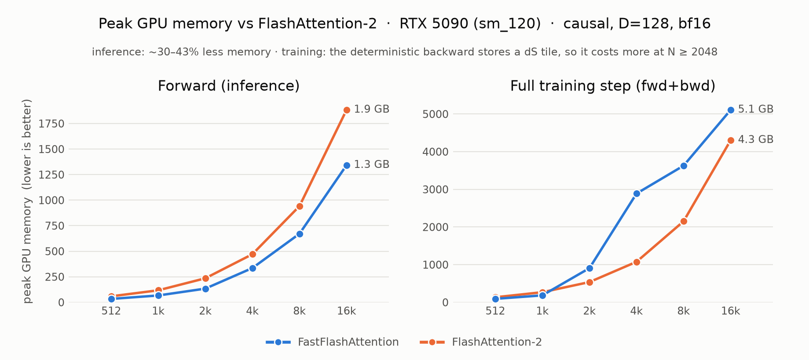

# FastFlashAttention

[](https://pypi.org/project/fastflash-attention/)
[](LICENSE)
[](pyproject.toml)
[](#status)
[](https://github.com/triton-lang/triton)
[](#determinism)

**Drop-in exact bf16 flash-attention for CUDA — one fused Triton kernel with a fast forward across all sequence lengths and a *deterministic* (non-atomic) backward.** Tuned on a **consumer GeForce RTX 5090** (Blackwell GB202, **sm_120**), where its forward beats FlashAttention-2 and its deterministic backward beats FA2's deterministic backward.

The public surface mirrors `torch.nn.functional.scaled_dot_product_attention`, so adoption is a textual swap at any SDPA call site.

## Status

An optimized **exact** attention kernel (not an approximation): fp32-faithful softmax at the bf16 floor (~0.2% rel-L2 vs fp32), forward + backward in a single `@triton.jit` kernel family.

- **Forward:** faster than FA2-default across the whole measured range — **1.07–1.30×** at D=128 causal (up to **1.78×** at short D=64), reaching **96%** of the bf16 matmul roofline at long context.
- **Backward:** bitwise-**deterministic** by construction (disjoint writes, no global atomics). Beats FA2's *deterministic* backward by **1.2–2.3×** (D=128), and reaches **~0.80–0.96×** of FA2's *default* (non-deterministic, atomic) backward.
- **Full training step (fwd+bwd):** beats FA2-deterministic by **1.4–2.1×**, and is roughly par with FA2-default (**0.86–1.18×**, faster at short context).
- **Scope:** exact attention only, with a strict input contract (below) and no hidden slow path.
- **Hardware:** tuned for the **consumer GeForce RTX 5090 (GB202, sm_120)** — *not* datacenter Blackwell (GB100/GB200, sm_100). It uses the standard sm_120 tensor-core MMA that Triton emits, and does **not** rely on datacenter-only 5th-gen tensor-core features (`tcgen05` MMA / tensor-memory, the `sm_100a` path). It runs on other CUDA GPUs, but the autotuned block/warp choices are picked for sm_120 and may be suboptimal elsewhere.

## Install

`torch` and `triton` must already be installed with a CUDA build matching your GPU (developed on torch 2.12.1+cu130 / triton 3.7.1, CUDA 13.0). Then:

```bash
pip install fastflash-attention
```

Or from source (add `.[bench]` for the benchmark/plot dependencies):

```bash
git clone https://github.com/AlcAI-Haven/FastFlashAttention && cd FastFlashAttention
pip install -e .
```

## Use

```python
import torch
from fastflash_attention import fast_attention, FastFlashAttention, is_eligible

q = torch.randn(2, 8, 4096, 128, device="cuda", dtype=torch.bfloat16)
k = torch.randn_like(q); v = torch.randn_like(q)

out = fast_attention(q, k, v, is_causal=True)            # [B, H, S, D] bf16

# differentiable: grads flow to q/k/v through the deterministic backward
q.requires_grad_(); out = fast_attention(q, k, v, is_causal=True); out.sum().backward()

attn = FastFlashAttention(is_causal=True)                # nn.Module
out = attn(q, k, v)
```

Strict policy + fallback — `fast_attention` runs when the input matches the supported contract and raises `UnsupportedConfig` otherwise (never a hidden slow path). Branch with the non-raising `is_eligible`:

```python
import torch.nn.functional as F
fn = fast_attention if is_eligible(q, k, v, is_causal=causal) else F.scaled_dot_product_attention
out = fn(q, k, v, is_causal=causal)
```

## Supported contract

| Requirement | Value |
|---|---|
| dtype | `bfloat16` |
| device | CUDA (q, k, v same device) |
| layout / shape | `[B, H, S, D]`, identical for q, k, v |
| head_dim `D` | power of two, `≤ 128` |
| masking | `is_causal` (bool) only |
| `scale` | optional, defaults to `1/√D` |
| `attn_mask` / `dropout_p` | must be `None` / `0` |

Anything else raises `UnsupportedConfig` (use `is_eligible` for a non-raising check). Not supported: GQA/MQA, fp16/fp32, additive bias/mask, dropout, differing key/value length.

## Benchmarks

Measured on **NVIDIA GeForce RTX 5090** (sm_120), torch 2.12.1+cu130, CUDA 13.0, flash_attn 2.8.4; **B=4, H=16**. CUDA-event timing, median over 30 iters (≥15 warmup excluded). Ratios are **FA2 / FastFlashAttention wall time — >1 means FastFlashAttention is faster.** bf16 matmul roofline ≈ **234 TF/s** (achieved, used as the %-roofline denominator).

Reproduce:
```bash
pip install -e ".[bench]"
python -m bench.benchmark        # full grid; add --quick for a smoke test
```

<p align="center">
  <picture>
    <source media="(prefers-color-scheme: dark)" srcset="assets/speedup_dark.png">
    
  </picture>
</p>

<p align="center"><sub>Speedup = FA2 / FastFlashAttention wall time (>1 = FastFlashAttention faster). Regenerate with <code>python -m bench.plot</code>.</sub></p>

### Forward (causal, D=128)

| N | FastFlashAttention (ms) | FA2 (ms) | ratio | % roofline |
|---:|---:|---:|---:|---:|
| 512 | 0.076 | 0.094 | **1.24×** | 24.1 |
| 1024 | 0.152 | 0.197 | **1.30×** | 48.4 |
| 2048 | 0.421 | 0.522 | **1.24×** | 69.7 |
| 4096 | 1.364 | 1.590 | **1.17×** | 86.1 |
| 8192 | 5.073 | 5.481 | **1.08×** | 92.6 |
| 16384 | 19.476 | 20.825 | **1.07×** | 96.5 |

### Backward (causal, D=128)

Both sides deterministic on the `-det` columns. `ratio_det` is the apples-to-apples deterministic comparison.

| N | FastFlashAttention (ms) | FA2-det (ms) | ratio_det | FA2-default (ms) | ratio_def |
|---:|---:|---:|---:|---:|---:|
| 512 | 0.188 | 0.229 | **1.22×** | 0.174 | 0.93× |
| 1024 | 0.433 | 0.662 | **1.53×** | 0.374 | 0.86× |
| 2048 | 1.085 | 2.305 | **2.12×** | 1.037 | 0.96× |
| 4096 | 3.732 | 8.522 | **2.28×** | 3.512 | 0.94× |
| 8192 | 15.309 | 33.384 | **2.18×** | 13.104 | 0.86× |
| 16384 | 62.642 | 132.860 | **2.12×** | 49.935 | 0.80× |

### Full training step, fwd+bwd (causal, D=128)

| N | FastFlashAttention (ms) | FA2-det (ms) | ratio_det | FA2-default (ms) | ratio_def |
|---:|---:|---:|---:|---:|---:|
| 512 | 0.269 | 0.367 | **1.37×** | 0.318 | **1.18×** |
| 1024 | 0.536 | 0.793 | **1.48×** | 0.499 | 0.93× |
| 2048 | 1.420 | 2.725 | **1.92×** | 1.476 | **1.04×** |
| 4096 | 5.026 | 9.908 | **1.97×** | 4.994 | 0.99× |
| 8192 | 20.331 | 38.764 | **1.91×** | 18.497 | 0.91× |
| 16384 | 82.334 | 170.402 | **2.07×** | 70.931 | 0.86× |

<details>
<summary><b>All configurations</b> — speedup ranges across N = 512…16384 (head_dim ∈ {64, 128} × causal / non-causal)</summary>

Min–max of the FA2 / FastFlashAttention ratio over the six sequence lengths (>1 = FastFlashAttention faster).

| Config | Forward | Backward vs FA2-det | Backward vs FA2-default | Step vs FA2-det | Step vs FA2-default |
|---|---|---|---|---|---|
| causal, D=128 | 1.07–1.30× | 1.22–2.28× | 0.80–0.96× | 1.37–2.07× | 0.86–1.18× |
| causal, D=64 | 1.04–1.78× | 0.72–1.40× | 0.62–0.95× | 1.24–1.45× | 0.78–1.62× |
| non-causal, D=128 | 1.04–1.26× | 1.13–2.36× | 0.79–0.98× | 1.20–1.98× | 0.86–1.06× |
| non-causal, D=64 | 1.00–1.48× | 1.20–1.35× | 0.72–1.02× | 1.18–1.58× | 0.78–1.42× |

Forward wins in every cell. The deterministic backward beats FA2-deterministic everywhere except the smallest D=64 case (N=512, 0.72×), and stays within ~0.6–1.0× of FA2's faster non-deterministic default. Full per-N numbers: run `python -m bench.benchmark` (writes `results/benchmark.jsonl`).

</details>

## Memory

FastFlashAttention runs natively in `[B, H, S, D]` (the SDPA layout) with output-only scratch, so **at inference it uses ~30–43% less peak VRAM than FlashAttention-2** at the same N. This is intrinsic, not a layout artifact — FA2 fed already-seq-major inputs measures the same. The training step is the deliberate trade in the other direction: the **deterministic backward stores a `dS` tile** (to avoid recomputation and global atomics — the source of its speed *and* bit-exactness), so its peak is **higher at N ≥ 2048**.

<p align="center">
  <picture>
    <source media="(prefers-color-scheme: dark)" srcset="assets/memory_dark.png">
    
  </picture>
</p>

Peak allocated VRAM (MB), causal D=128, B=4 H=16. `Δ vs FA2` is negative when FastFlashAttention uses **less**. Reproduce with `python -m bench.mem` (each point measured in a fresh process).

| N | Fwd (MB) | FA2 fwd (MB) | Δ vs FA2 | Train (MB) | FA2 train (MB) | Δ vs FA2 |
|---:|---:|---:|---:|---:|---:|---:|
| 512 | 34 | 59 | **−43%** | 93 | 135 | −31% |
| 1024 | 67 | 118 | **−43%** | 185 | 269 | −31% |
| 2048 | 134 | 235 | **−43%** | 907 | 538 | +69% |
| 4096 | 336 | 471 | **−29%** | 2888 | 1076 | +168% |
| 8192 | 671 | 942 | **−29%** | 3628 | 2152 | +69% |
| 16384 | 1342 | 1883 | **−29%** | 5109 | 4303 | +19% |

If inference / KV-cache memory is your constraint, FastFlashAttention is a clear win; if training-step peak memory is the binding constraint at long context, that extra `dS` storage is the price of the deterministic, faster backward.

## Determinism

The backward is bitwise-identical across runs — disjoint writes, no global atomics — verified by `tests/test_determinism.py`. This is the property FA2 only provides via its slower `deterministic=True` path; FastFlashAttention is deterministic by construction, at a fraction of that path's cost.

## Tests

```bash
pytest tests/     # forward+backward parity vs fp32 SDPA truth, backward determinism, eligibility contract
```

Parity reference is `F.scaled_dot_product_attention` upcast to fp32, so the suite has no `flash_attn` dependency (that is benchmark-only).

## License

MIT — see [LICENSE](LICENSE).
